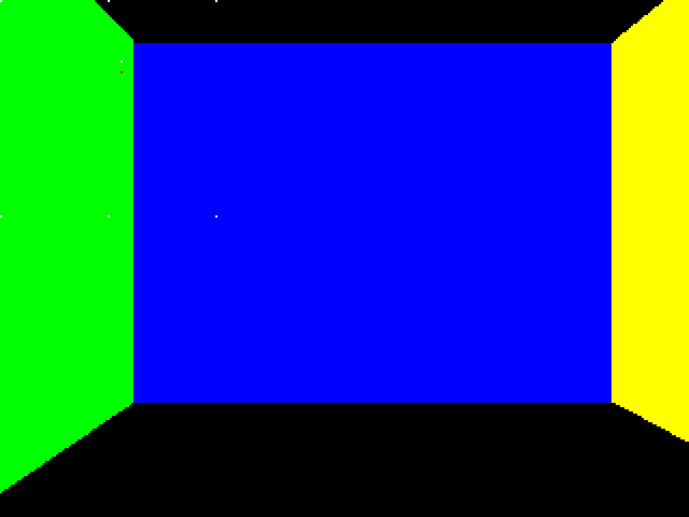
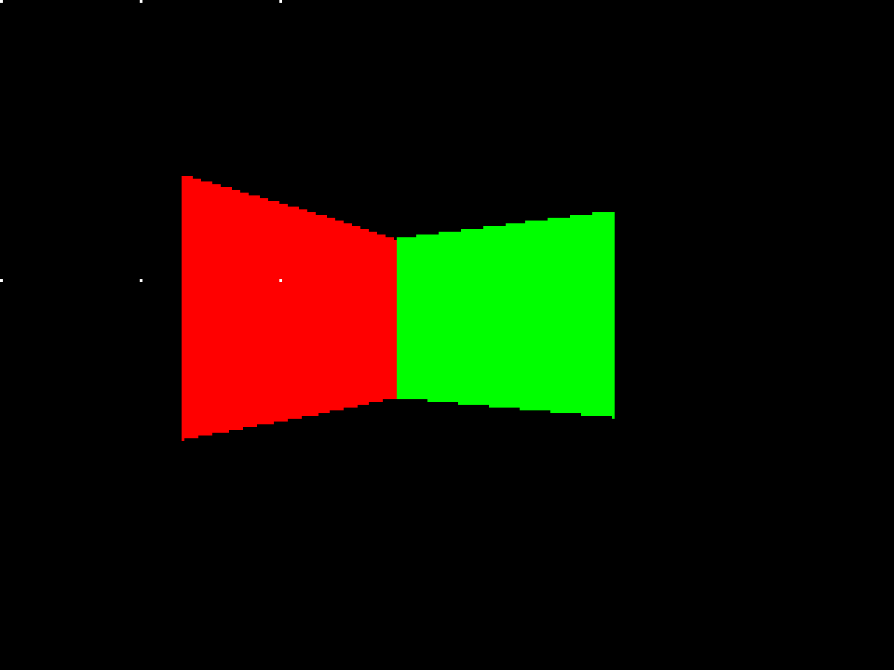

# A Simple Doom-like BSP Rendering Engine

This is my final project for CS3520 Programming in C++. This project was my attempt at constructing a DOOM-style rendering engine. For the sake of time, I set the scope of my project low. My main goal with this project was to properly render a wall/room in 3D space, implement BSP for rendering, and write the project in an object oriented way.

## [How to Compile and Run]

- Compile with: `g++ -std=c++17 -g ./src/*.cpp ./src/game/*.cpp ./src/logic/*.cpp ./src/misc/*.cpp ./src/render/*.cpp ./src/wad/*.cpp -o prog -I./include -lsfml-graphics -lsfml-window -lsfml-system` (this was the only way I knew how to do it, there's probably a much smarter way of searching through all nested directories for cpp files)
- Run with: `./prog ./test/doom1.txt`
- Debug with gdb: `gdb ./prog --tui`
    - When debugging then do `run ./test/doom1.txt`

Move the player with WASD and turn left and right with Q and E respectively.

You can replace `doom1.txt` with your own level file if you want to make your own following the guidelines listed in `./test/README.md`, but it's a bit of a pain in the ass. Typically a level editor generates WAD files for you. I thought about making one, but I decided against it. Might be something to do in the future, who knows.