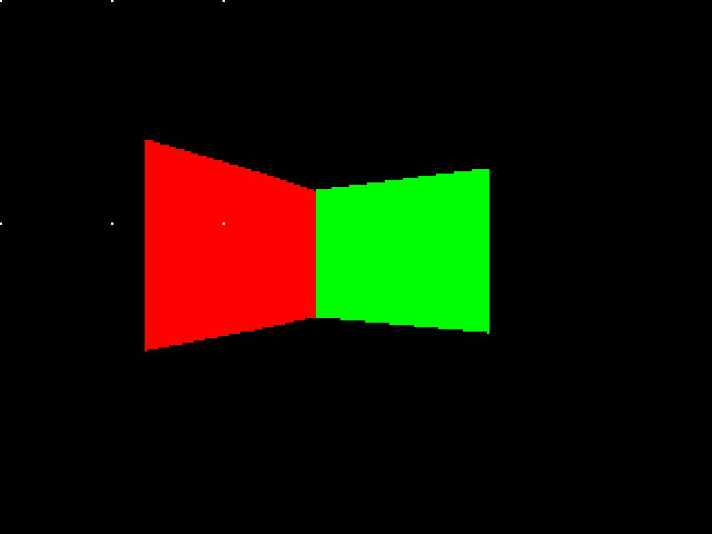

# DOOM

This project was my attempt at constructing a DOOM-style rendering engine. For the sake of time, I set the scope of my project low. My main goal with this project was to properly render a wall/room in 3D space, implement BSP for rendering, and write the project in an Object Oriented way.

## [Resources]

- Youtube Playlist of all videos used
  - <https://youtube.com/playlist?list=PLfQzhHmKzSPp6EmFB_-2VXIJPu2wy6Mhm>
- Wikipedia page for general guideline
  - <https://en.wikipedia.org/wiki/Doom_engine>
- Doom Wiki page
  - <https://doomwiki.org/wiki/Doom_engine>
- GitHub repo of port of Doom from C to C++
  - <https://github.com/patricia-gallardo/cpp-doom>
- Doom Engine Review
  - <https://fabiensanglard.net/doomIphone/doomClassicRenderer.php>
  
## [How to Compile and Run]

- Compile with: `g++ -std=c++17 -g ./src/*.cpp ./src/game/*.cpp ./src/logic/*.cpp ./src/misc/*.cpp ./src/render/*.cpp ./src/wad/*.cpp -o prog -I./include -lsfml-graphics -lsfml-window -lsfml-system` (this was the only way I knew how to do it, there's probably a much smarter way of searching through all nested directories for cpp files)
- Run with: `./prog ./test/doom1.txt`
- Debug with gdb: `gdb ./prog --tui`
    - When debugging then do `run ./test/doom1.txt`

Move the player with WASD and turn left and right with Q and E respectively.

You can replace `doom1.txt` with your own level file if you want to make your own following the guidelines listed in `./test/README.md`, but it's a bit of a pain in the ass. Typically a level editor generates WAD files for you. I thought about making one, but I decided against it.

## [Design]

In terms of designing, I had to do a lot of research. For this part, the DOOM wiki and the C++ port of DOOM helped a ton as the wiki detailed every single major data structure present in a level, and I used the port to further understand how the design worked. See `notes.md` for the initial notes I took from the wiki. Here's the general overview of the final design:

### DoomGame

The high level runner for the game. Manages the window and renderer. Handles inputs and runs the main game loop.

### DoomRenderer

The renderering engine for the game. takes care of all rendering and displaying for the game. Holds a pixel buffer that it makes changes to during rendering before displaying said pixel buffer to the window held by DoomGame. Also holds a RenderState that it references for information used while rendering.

### RenderState

Holds information required for rendering properly like the view width and height (different from the dimensions of the actual window), and the pixel scale. Also holds and manages all the game objects that need to be rendered. Currently has "ownership" of these objects and is responsible for cleaning up after them.

### Vertex

A simple point with x and y coordinates.

### Linedef

Lines that make up the shape of the map. Contains one or two sidedefs that have textures. Divides the map into sectors.

### Sidedef

Contains the texture (color) data for each linedef that it belongs to. Holds a pointer to the sector that it belongs to.

### Sector

Represents an area in the game. Referenced by Sidedefs. Has a floor and ceiling height and color. It also has light levels. I never got around to rendering the floor and ceiling, but I have a general idea of how I can do it. I didn't get around to using the light levels to make gradients either.

### Node

Nodes of a BSP tree that sorts all the subsectors in the correct order for rendering. Each node has a partition line that splits it into a right child area and a left child area, each of which can either be another node or a subsector.

### Subsector

A subsector is a collection of line segments (segs) forming part or all of a sector such that when inside a subsector, no part of any one seg will block the view of any other seg. It is a convex polygon that may have implicit edges where the BSP tree has partition lines.

### Seg

Segments of linedefs, describes portion of linedef that borders the subsector that this seg belongs to. These are the objects that actually get rendered as a wall, not linedefs or sidedefs.

### BoundingBox

A simple bounding box with 4 coordinates. Used to determine if we should render the child node that the player is not in. The visibleToPlayer method is not actually implemented.

### Things

Represent an object in the game, called a mobj (map object) in code. Has x y and z positions along with the angle the object is facing.

### Player

A player is a map object. Along with all the information a mobj holds, also holds a viewz position  and a base view height for rendering and bobbing view.

### WadFile

This class is used to parse a mock WAD file into a playable level for the renderer.

## [Technical Challenge]

This project was extremely technically challenging. The first hurdle to get over was getting the framework of the design in place. For this, the DOOM wiki helped a lot in getting a grasp of the general structure of a level. Luckily, someone had made a C++ port of DOOM. A lot of my design is inspired from that source code and adapted to be object oriented, as the port was still done with functional programming. After adapting the traditional DOOM data structures, I then made the DoomGame and DoomRenderer classes to isolate responsibility for game logic and game rendering.

The next stage was to actually understand rendering. This was by far the most challening and also the stage that took the longest to get done. First I wanted to just get a wall rendered without any regard for how the actual program flow occured in the source code, as I had already spent too long designing too much. However, I most definitely was not going to reinvent the wheel. I used the already established trigonmetric math and several video tutorials to help with the process.

After I successfully rendered a wall to the screen in proper perspective, then came understanding how BSP worked. This was also a rather long process. I read a few wiki pages here and there, but I mostly looked at the C++ port to see how the main game loop happened. I spent quite a while traversing the huge forest that was the source code. The general rendering loop looks a little bit like this:

`Recursively travel BSP tree to find subsectors -> render segs in subsectors while gathering plane (floor and ceiling) information -> render planes -> render things (mobjs)`

The recursive search of the BSP tree is also rather simple. We first find the side of the node the player is on and recursively call into that side if it is a node. If it is a subsector, we render it. Then we determine if the player can see the other child of the node. If they can, we recursively render that as well.

## [Results]

I definitely learned a lot from this project, and that was my main goal with taking up such a difficult task. I wanted to try my hand at a larger scale C++ project to get experience working with a larger codebase. I am definitely a lot more confident now than I was before at working with C++ and have a better understanding of fundamentals like pointers, memory, etc. I gained a little bit of experience with separation of responsibility in a skeleton "game engine" of sorts, and is something I look forward to learning more about. I was able to explore the inner workings of the DOOM engine as that had been something I had been meaning to do and was quite curious of. I was also introduced to the sheer mad genius of the legend known as John Carmack and his coding wizardry. I learned about how rendering an object that exists in theoretical 3D onto a 2D screen actually works. A big thing was probably learning about BSP. It seems very similar to the QuadTree concept that we explored a little bit in class, in terms of reducing the scope of what we have to make computations on to speed up runtime. I didn't have as much time as I wanted to do more with this project, but this was a good experience and the skills gained from this will definitely be a help in the future.

## [Additional Notes]

Like I said before, there was a lot I wanted to work on that I just didn't have the time to do. What I've done is mostly setting up design, rendering properly, and using a BSP tree to speed up rendering. I wanted to do more with game logic like player collision with walls, height changes, movement from sector to sector, etc. The next thing I was going to implement would probably have been rendering the floor and ceiling planes along with properly rendering window segs and changing heights between sectors.
